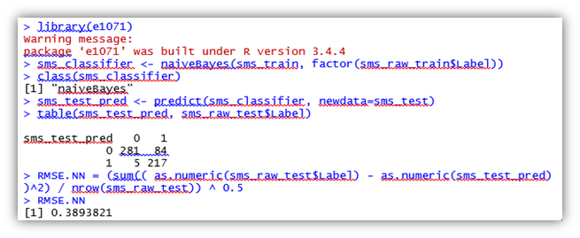
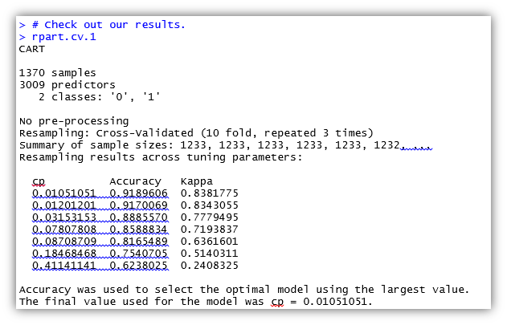

# Spam prediction from Youtube Comments
## Data Description
The dataset is about “YouTube Spam Collection”. It consists of different users comments on five most popular videos on YouTube. The dataset contained 5 attributes and 1956 instances. The comments are already classified as spam and ham in the “Class” attribute of the dataset. “Class” is a numeric attribute, storing value 0 for ham and 1 for spam. 

## Objective
The objective is to build a model for automatic detection of spam and ham comments. Such model will be very useful in controlling the online spam comments, fake advertisements and social engineering attacks.

## Word Clouds
The word clouds of both spam and ham calss were constructed to analyse the most occuring words in both classes.
#### Spam

#### Ham

## Naive Bayesian Classifier
Naïve Bayesian classification employees the concept of probability. It is called naïve because it ignore the conditional correlations among the attributes. 
The Naïve Bayesian classifier was implemented in R programming language using the packages of “e1071”. The dataset was split into 70% training data and 30% testing data. The training tuples were selected randomly by making sure that the distribution of the spam and ham comments in both training and testing data do not change. The words that appears less than two times were removed as it had improved the classification accuracy. 
The naïve Bayesian classifier was tested on the testing data and generated the confusion matrix. The classifier successfully classified 498 test tuples out of 589. The classifier failed to correctly predict the class of 89 test tuples. The RMSE of the classifier is 0.38.  A section of the code is displayed here, for complete code please refer the attached file “Naïve_Bayesian_D2.R”. 

## Decision Trees
The second algorithm selected for textual classification was decision tree using “rpart” method. R programming language is use for decision tree classifier using the packages of “caret” and “quanteda”. The dataset was cleaned by removing stopping words, punctuations, whitespaces and symbols. The remaining keywords are converted to lower case and stemmed to their original words. The dataset is split into 70-30 train and test data. 
Here, the cross validation approached is used with k values set to 10. The 10 fold cross validation is repeated for three times. The decision tree achieve an accuracy of 91.89%. The results are shown in the following picture. The complete code is provided in the attached file “Decision_Tree_D2.R”. 

